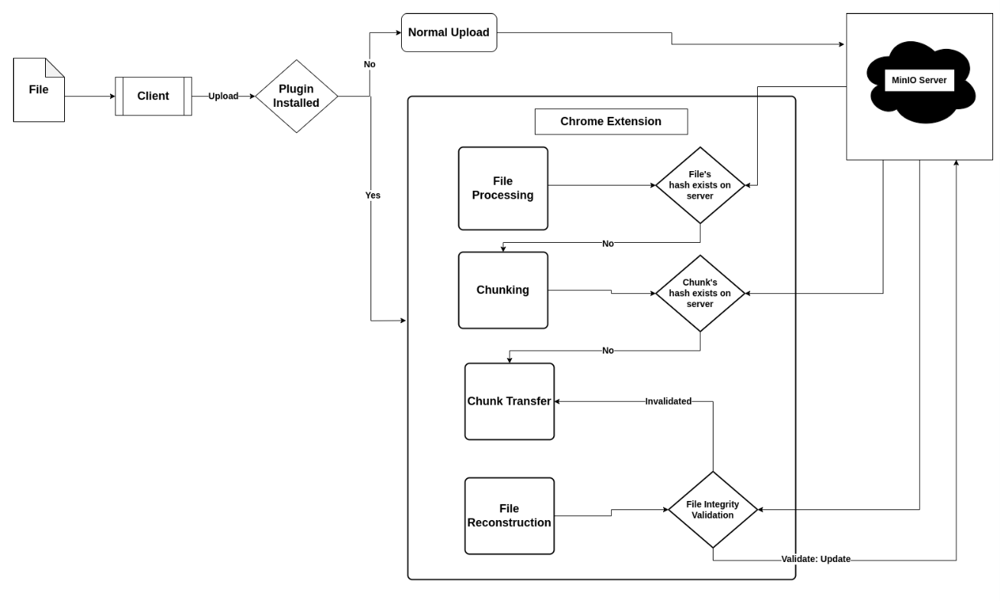
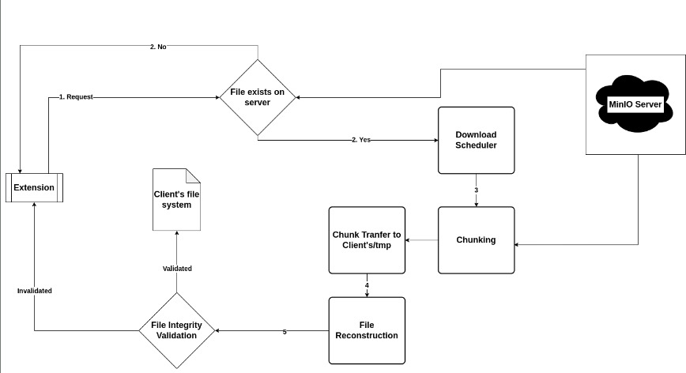
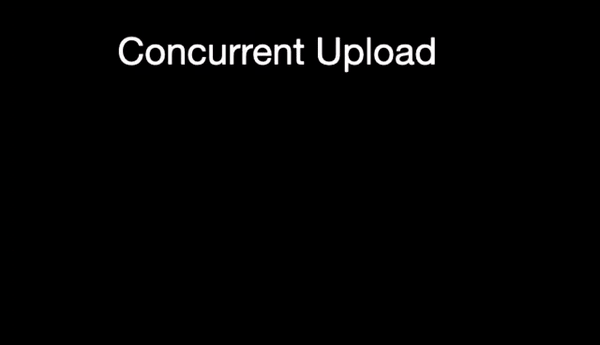
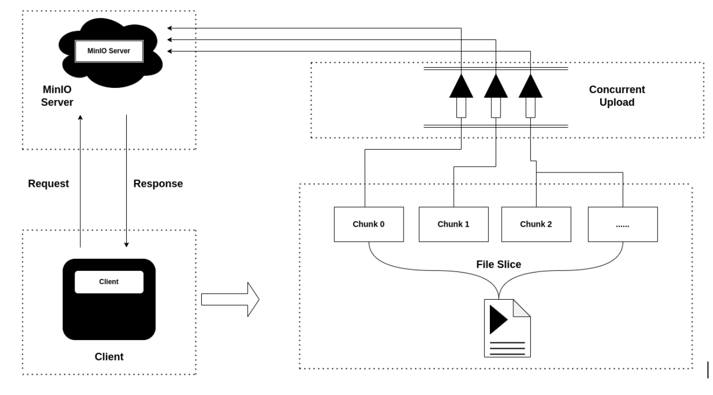

# File Upload/Download Manager
**Team VSKR**: Siva Koti Reddy (2021101135), Vedanivas (2021101037)

## Overview

File upload and download are vital components of our data foundation platform. However, popular browser-native download managers often fall short for large files due to limitations, such as:
- Lack of checkpointing for broken downloads.
- Absence of native support for multithreaded downloads, often requiring third-party packages.

Additionally, common npm packages for file uploads lack native support for chunked and parallelized uploads, relying on server configurations.

To address these challenges, we propose a Chrome v3 plugin to support:
- Chunked, parallelized, and checkpointed uploads.
- Faster and more efficient downloads tailored to our platform.

### Key Benefits

Our Chrome v3 Plugin offers several advantages:
- Client-side page modifications, including adding a dedicated 'Download Button.'
- Continued server interaction even when the client application is closed, ensuring uninterrupted downloads.
- Enhanced user-friendliness.

### Core Functionalities of the Plugin

The plugin handles key functionalities:
- **Chunking**: Dividing files into smaller chunks for efficient transfer.
- **Upload and Download Management**: Handling the upload and download of chunks while allowing users to pause and resume transfers at any moment.
- **Progress Tracking**: Real-time display of upload and download progress.
- **File Integrity Validation**: Ensuring data integrity.
- **Error Handling**: Handling network interruptions gracefully.

In conclusion, our Chrome v3 Plugin empowers users with faster and more reliable file uploads and downloads, making it a valuable addition to our data foundation platform.

### Components

The system architecture comprises five modules/components, working in series and transferring data between each other.

- **Client to Server Upload**

- **Server to Client Download**

### Sequence Diagram

## System Requirements

- The project primarily involves implementing necessary functionalities using JavaScript.
- We intend to publish it as a Chrome v3 plugin, installable via the browser's extension manager.
- Access to the backend's HTTP port is required for TCP/IP communication.
- File transfer to MinIO storage will be facilitated through existing pipelines.

We now go into the overview of each of these components. The following figure summarizes the chunking and concurrent uploading pipeline. 

### Functional Requirements

**File Preprocessing**
- Calculates the MD5 hash of the file and sends it to the server.
- Server checks for existing file hashes; if the file exists, the user is notified, and upload is canceled to save bandwidth.
- If the file doesn't exist, it proceeds to chunking.

**File Chunking**
- Splits the file into smaller chunks and sends their hashes to the server.
- Server checks for missing chunk hashes, which haven't been transferred due to a previous failed upload.
- Only missing chunks are sent to the server.

**Concurrent Chunk Transfer**
- Transfers chunks concurrently to/from the server for maximum speed.
- Saves chunks on the server and reports progress while updating the filesystem metadata.

**File Reconstruction**
- Verify the hash of each of the chunks received. As it is TCP/IP, the intergrity of transferred files are guaranteed. 
- Merge the received chunks to reconstruct the original file.

**File Integrity Validation**
- Compare the checksum of the reconstructed file with the initial hash of the whole file received from the client initially.
- If validated, update the filesystem metadata.
- If not validated, delete all existing files and request the user to re-upload.

**Error Handling**
- Stores received chunks with a certain time-to-live to resume from checkpoints in case of client-side network interruptions.

**Progress Tracking**
- Users should be able to see the progress of the uploads/downloads of each of the files

**Pause/Resume**
- Users should be able to pause/resume the upload/download of any file at any instant

### Non-Functional Requirements

**Usability**
- The Chrome plugin must be compatible with the Chrome browser and should offer easy installation.
- The user interface (UI) should be designed to be intuitive and user-friendly.

**Performance**
- The plugin should significantly enhance the speed of uploads and downloads.

**Scalability**
- The plugin should efficiently handle multiple concurrent uploads and downloads.
- It should seamlessly manage large files without performance issues.

**Security**
- The plugin must ensure data integrity by verifying file integrity both before and after upload/download processes.

## Enhancements

- Chunked downloads.
- Progress bars.
- Integration with MinIO server.
- Pause/resume for multiple uploads/downloads.
- Functional Chrome plugin integrated with Data Foundation website.

## Deliverables

- Support for reliable uploads/downloads.
- Web-based data configuration.
- Management of multiple data transfer sessions.
- Data transfer verification.
- Chrome V3 plugin integration (UI/monitoring/control).
